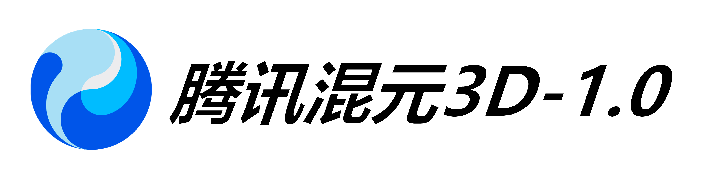
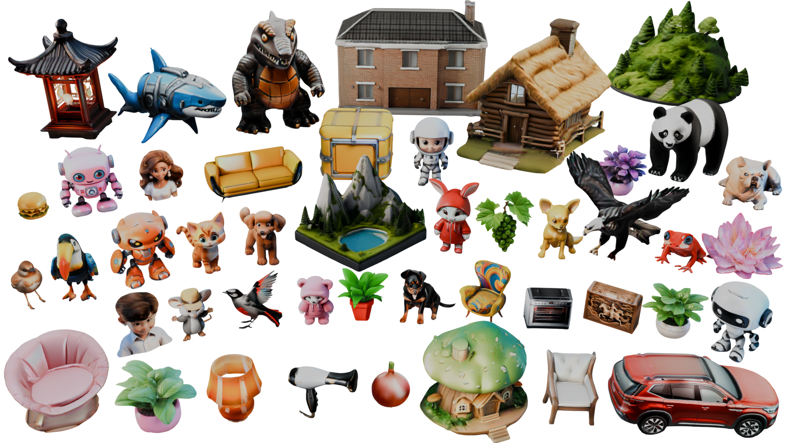
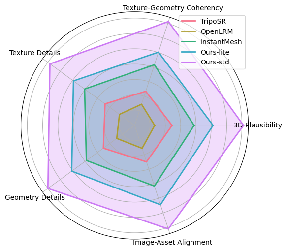
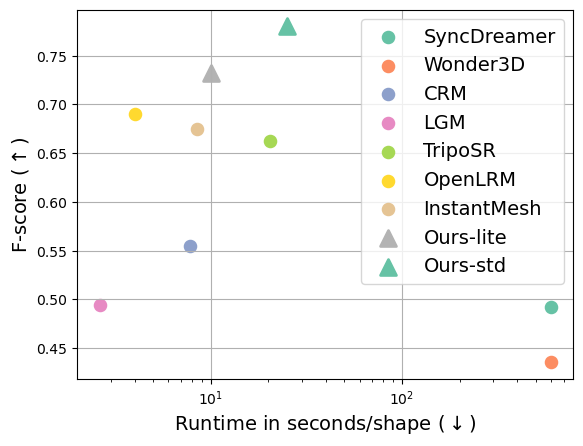

<!-- ## **Hunyuan3D-1.0** -->

<p align="center">
  
</p>

# Tencent Hunyuan3D-1.0: A Unified Framework for Text-to-3D and Image-to-3D Generation

[\[Code\]](https://github.com/tencent/Hunyuan3D-1) 
[\[Huggingface\]](https://huggingface.co/tencent/Hunyuan3D-1) 
[\[Report\]](https://arxiv.org/pdf/2411.02293) 


## 🔥🔥🔥 News!!

* Nov 5, 2024: 💬 We support demo running  image_to_3d generation now. Please check the [script](#using-gradio) below.
* Nov 5, 2024: 💬 We support demo running  text_to_3d generation now. Please check the [script](#using-gradio) below.


## 📑 Open-source Plan

- [x] Inference 
- [x] Checkpoints
- [ ] Baking related
- [ ] Training
- [ ] ComfyUI
- [ ] Distillation Version
- [ ] TensorRT Version


## **Abstract**
<p align="center">
  
</p>

While 3D generative models have greatly improved artists' workflows, the existing diffusion models for 3D generation suffer from slow generation and poor generalization. To address this issue, we propose a two-stage approach named Hunyuan3D-1.0 including a lite version and a standard version, that both support text- and image-conditioned generation.

In the first stage, we employ a multi-view diffusion model that efficiently generates multi-view RGB in approximately 4 seconds. These multi-view images capture rich details of the 3D asset from different viewpoints, relaxing the tasks from single-view to multi-view reconstruction. In the second stage, we introduce a feed-forward reconstruction model that rapidly and faithfully reconstructs the 3D asset given the generated multi-view images in approximately 7 seconds. The reconstruction network learns to handle noises and in-consistency introduced by the multi-view diffusion and leverages the available information from the condition image to efficiently recover the 3D structure.

Our framework involves the text-to-image model, i.e., Hunyuan-DiT, making it a unified framework to support both text- and image-conditioned 3D generation. Our standard version has 3x more parameters than our lite and other existing model. Our Hunyuan3D-1.0 achieves an impressive balance between speed and quality, significantly reducing generation time while maintaining the quality and diversity of the produced assets.


## 🎉 **Hunyuan3D-1 Architecture**

<p align="center">
  
</p>


## 📈 Comparisons

We have evaluated Hunyuan3D-1.0 with other open-source 3d-generation methods, our Hunyuan3D-1.0 received the highest user preference across 5 metrics. Details in the picture on the lower left.

The lite model takes around 10 seconds to produce a 3D mesh from a single image on an NVIDIA A100 GPU, while the standard model takes roughly 25 seconds. The plot laid out in the lower right demonstrates that Hunyuan3D-1.0 achieves an optimal balance between quality and efficiency.

<p align="center">
  
  
</p>

## Get Started

#### Begin by cloning the repository:

```shell
git clone https://github.com/tencent/Hunyuan3D-1
cd Hunyuan3D-1
```

#### Installation Guide for Linux

We provide an env_install.sh script file for setting up environment. 

We recommend python3.9 and CUDA11.7+
```
conda create -n hunyuan3d-1 python=3.9
conda activate hunyuan3d-1
bash env_install.sh
```

#### Download Pretrained Models

The models are available at [https://huggingface.co/spaces/tencent/Hunyuan3D-1](https://huggingface.co/spaces/tencent/Hunyuan3D-1):

+ `Hunyuan3D-1/lite`, lite model for multi-view generation.
+ `Hunyuan3D-1/std`, standard model for multi-view generation.
+ `Hunyuan3D-1/svrm`, sparse-view reconstruction model.


To download the model, first install the huggingface-cli. (Detailed instructions are available [here](https://huggingface.co/docs/huggingface_hub/guides/cli).)

```shell
python3 -m pip install "huggingface_hub[cli]"
```

Then download the model using the following commands:

```shell
mkdir weights
huggingface-cli download tencent/Hunyuan3D-1 --local-dir ./weights

mkdir weights/hunyuanDiT
huggingface-cli download Tencent-Hunyuan/HunyuanDiT-v1.1-Diffusers-Distilled --local-dir ./weights/hunyuanDiT
```

#### Inference 
For text to 3d generation, we supports bilingual Chinese and English, you can use the following command to inference.
```python
python3 main.py \
    --text_prompt "a lovely rabbit" \
    --save_folder ./outputs/test/ \
    --max_faces_num 90000 \
    --do_texture_mapping \
    --do_render
```

For image to 3d generation, you can use the following command to inference.
```python
python3 main.py \
    --image_prompt "/path/to/your/image" \
    --save_folder ./outputs/test/ \
    --max_faces_num 90000 \
    --do_texture_mapping \
    --do_render
```
We list some more useful configurations for easy usage:

|    Argument        |  Default  |                     Description                     |
|:------------------:|:---------:|:---------------------------------------------------:|
|`--text_prompt`  |   None    |The text prompt for 3D generation         |
|`--image_prompt` |   None    |The image prompt for 3D generation         |
|`--t2i_seed`     |    0      |The random seed for generating images        |
|`--t2i_steps`    |    25     |The number of steps for sampling of text to image  |
|`--gen_seed`     |    0      |The random seed for generating 3d generation        |
|`--gen_steps`    |    50     |The number of steps for sampling of 3d generation  |
|`--max_faces_numm` | 90000  |The limit number of faces of 3d mesh |
|`--save_memory`   | False   |text2image will move to cpu automatically|
|`--do_texture_mapping` |   False    |Change vertex shadding to texture shading  |
|`--do_render`  |   False   |render gif   |


We have also prepared scripts with different configurations for reference
```bash
bash scripts/text_to_3d_demo.sh 
bash scripts/text_to_3d_fast_demo.sh 
bash scripts/image_to_3d_demo.sh 
bash scripts/image_to_3d_fast_demo.sh 
```

This example requires ~40GB VRAM to run.

#### Using Gradio

We have prepared two versions of multi-view generation, std and lite.

For better results, the std version of the running script is as follows
```shell
python3 app.py
```

For faster speed, you can use the lite version by adding the --use_lite parameter.

```shell
python3 app.py --use_lite
```

Then the demo can be accessed through http://0.0.0.0:8080. It should be noted that the 0.0.0.0 here needs to be X.X.X.X with your server IP.

## Camera Parameters

Output views are a fixed set of camera poses:

+ Azimuth (relative to input view): `+0, +60, +120, +180, +240, +300`.


## Citation

If you found this repository helpful, please cite our report:
```bibtex
@misc{yang2024tencent,
    title={Tencent Hunyuan3D-1.0: A Unified Framework for Text-to-3D and Image-to-3D Generation},
    author={Xianghui Yang and Huiwen Shi and Bowen Zhang and Fan Yang and Jiacheng Wang and Hongxu Zhao and Xinhai Liu and Xinzhou Wang and Qingxiang Lin and Jiaao Yu and Lifu Wang and Zhuo Chen and Sicong Liu and Yuhong Liu and Yong Yang and Di Wang and Jie Jiang and Chunchao Guo},
    year={2024},
    eprint={2411.02293},
    archivePrefix={arXiv},
    primaryClass={cs.CV}
}
```